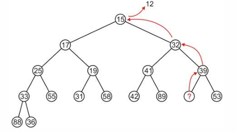
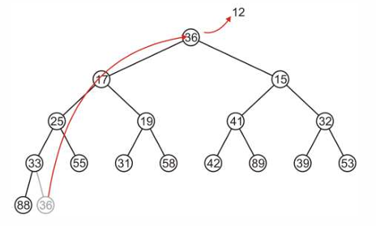
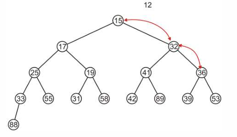

堆的ADT是“优先队列（Priority Queue）”。

## 优先队列的定义与操作

- **定义**：与标准队列的“先进先出” 不同，优先队列允许弹出具有最高优先级的对象 ，一般定义 0 为最高优先级 。
- **优先队列的两种简单实现** 

1. **多队列 (Multiple Queues)** 
    - **方法**：创建一个包含 M 个队列的数组，每个队列对应一个优先级。
    - **分析**：`Push` 操作为 $\Theta(1)$ ，但 `Top` 和 `Pop` 为 $O(M)$ 。但是这个方法限制了优先级范围（只能为整数），并且每需要一个优先级就要多一个队列，空间开销大。

2. **AVL 树 (AVL Trees)** 
    - **方法**：使用 AVL 树存储对象，按优先级排序。
    - **分析**：插入、访问顶部和移除操作均为 $\Theta(ln(n))$ ，**但想要维持树的平衡会在性能上有显著开销**；

***两个子树之间没有任何必然关系！***

对于普通的二叉堆来说，仍旧是相同的几个操作：

`push:` 在叶子节点插入，然后上滤；

`pop:` 弹出根节点。

`Top` ：$O(1)$ ；返回根节点
## 二分最小堆 Binary Min-Heap

**定义：** 非空二叉树，且子节点<=父节点；如果有子树，那么也都是二叉最小堆。由于需要保持二分最小堆的性质，因此 pop 和 push 的操作需要进行修改。

`pop` ：删去根节点，然后将子树中最小的节点上提，递归进行，直到根节点成为整棵树最小的那个节点。

`Push` : 对于一个二叉堆，插入操作**一般在叶子节点**，但是也有的在root节点。
- 将新节点作为叶子节点插入；
- 将该节点上滤（Percolate up）：如果比父节点更小，就向上交换，递归进行。

为了使二分堆保持**平衡**，可以使用**完全（Complete）二分堆**来表示。

### 完全最小二分堆及其优化

但是问题来了，如果直接从根节点的子节点挑最小然后像上面的 `pop` 操作一样递归上提，那么就会导致下图中的**不完全**二分堆！

假设我们进行最小二分堆的 `pop` 操作，那么就需要将这棵树最小的节点（12）上提。找到并弹出 12，即导致下面的不完全树。



所以我们选择将**最近一次插入**作为根节点（此时最小二分堆最小的节点）的替补，这样就一定能保证堆还是完全的，然后我们再从根节点下滤（percolate down），使其保持一个最小二分堆的性质。*P44*

我们使用最新加入的节点（36）替换12所处的根节点，弹出12。



然后将36下滤。



这样就保持了最小二分堆的性质并且确保了完全堆。

在最小二分堆中，上滤和下滤都是挑最小的子节点来替换。

对于一个完全树，我们还可以使用数组来存储，因为前者可以通过**广度优先（Breadth First Traversal）** 进行遍历并储存为数组。

将索引为 0 的位置空出来，对于一个索引为 $k$ 的元素来说：
- 父节点索引为 $\frac{k}{2}$ 
- 子节点索引为 $2k$ 和 $2k+1$ 
简单的数学归纳

插入 `push` 元素并上滤：
如果现在数组内有 count 个数，那么插入的元素位置就是 posn=count+1 
- 将位置 posn 的元素与位置 posn/2 的元素进行比较（与父节点比较）；
- 如果顺序不正确，交换并设置 posn=posn/2，重复上滤操作；
*P64*

`pop` 操作原理同上，只是将根节点换为最新的节点时执行下滤，看 2k 和 2k+1
*P68*

时间复杂度分析
- `top` : $\Theta(1)$ 
- `pop` : $O(ln(n))$ 
- `push` : $O(ln(n))$  最好情况 $\Theta(1)$ ，最坏情况 $\Theta(ln(n))$ 

**最大二叉堆（Max Binary-Heap）**，即根节点为最大值，子树<=父节点

## 堆排序

堆排序是一个 $\Theta(n \ln(n))$ 的排序算法；
基本策略：给定一个包含 $n$ 个对象的无序列表，先将它们放入一个堆中，然后再依次从堆中取出。

使用最小堆：将 $n$ 个对象插入一个最小堆，然后连续取出 $n$ 个对象，它们会按顺序出来。这个取出 $n$ 个对象的操作需要 $O(n \ln(n))$ 的时间。
但是，使用最小堆来进行操作会需要额外的一个大小为 n 的堆来存放，这会消耗内存，因此也不是我们想要的 in-place （就地）的算法；

为了实现就地算法，可以考虑采用**最大堆**。

先将 unsorted array 原地转化成一个最大堆，这里要使用堆的数组表示，但是没有把 0 空开因此我们的索引计算方式需要发生改变，对于索引为 k 的元素：
- 父节点为 $\frac{k+1}{2}-1$ 
- 子节点为 $2k+1$ 和 $2k+2$ 

### 就地堆化（In-Place Heapification） 

#### 树结构示意
- 我们从下往上考虑，每个叶子节点都是自己的最大堆；对每一层子树的父节点考虑；
- 然后一直从右往左，从下往上对每个等级的堆进行“下滤”（将小元素下沉）看图
（*树结构图示 P109* ）更好理解；
- 这个交换过程可能需要递归进行，直到该节点下滤到正确的位置 。


从第一个非叶子节点87开始，这个子树已经是最大堆了。

23这个子树不是最大堆，将其和子节点中最大的进行交换。

继续向上找到非叶子节点进行最大堆化。


Heaplify 时间复杂度为：$\Theta(n)$   *P121*

#### 数组示意

数组的就地堆化： *P123* 
- 第一个非叶子节点的索引为 $\frac{n}{2}-1$ （n为数组长度，最后一个节点，也是叶子节点的索引为 n-1）
- 然后不断对前面这些非叶子节点进行下滤（可能需要递归进行）。


从3开始比较他的子节点，将最大的上提，3下滤。


比较17的子节点，进行下滤。


进行到根节点46时，需要递归下滤（下滤的实现其实就是递归的）。

*131-135 的解释是错的*

排序：将最大堆转换成一个排序好的（升序）数组。
- 当数组被构建成一个最大堆后，堆顶（`array[0]`）就是最大的元素。
- **“弹出”最大值**：将堆顶元素（最大值）与堆的最后一个元素交换。
- **放置最大值**：交换后，最大的元素就被放置在了数组的末尾，这是它排序后的正确位置。
- **缩小堆**：将堆的大小减 1（即排除掉刚刚放到末尾的那个最大元素）。
- **恢复堆**：由于交换，新的堆顶元素（原先的最后一个元素）可能破坏了最大堆的性质。因此，对新的堆顶（`array[0]`）执行“下滤”操作，使其在缩小后的堆中恢复最大堆的性质。
- **重复**：重复这个“交换-缩小-下滤”的过程 $n$ 次，直到堆为空。

## 时间复杂度分析

堆化需要 $\Theta(n)$ 的时间，将 n 个元素从大小为 n 的堆中弹出需要 $\Theta(ln(n))$ 的时间。
总的来说需要 $\Theta(ln(n))$ 的时间。

给出具体的代码实现：
```cpp
// By Gemini 2.5 pro
// i 要下滤的子树的根
// n 长度

void percolateDown(int arr[], int n, int i) {
    int largest = i; // 假设根节点 i 是最大的 
    
    int left = 2 * i + 1;  // 左子节点
    int right = 2 * i + 2; // 右子节点

    // 检查左子节点是否在堆范围内，并且是否大于当前最大值
    if (left < n && arr[left] > arr[largest]) {
        largest = left;
    }

    // 检查右子节点是否在堆范围内，并且是否大于当前最大值
    if (right < n && arr[right] > arr[largest]) {
        largest = right;
    }

    // 如果根节点 i 不是最大的节点
    if (largest != i) {
        // 交换根节点和最大的子节点
        std::swap(arr[i], arr[largest]);
        // 交换后，原来的根节点 arr[i] 下降到了索引 largest 的位置
        // 需要递归地对这个新位置进行下滤，以确保子树完全满足最大堆性质
        percolateDown(arr, n, largest);
    }
}

/**
 * @brief 执行堆排序
 *
 * 算法基于文档中的两个主要阶段：
 * 1. 就地堆化 (In-place Heapification)
 * 2. 排序（重复弹出最大元素）
 *
 * @param arr 要排序的数组
 * @param n 数组的大小
 */
void heapSort(int arr[], int n) {
    
    // --- 阶段 1: 构建最大堆 (Heapification) ---
    //
    // 我们从最后一个非叶子节点开始，自底向上调整所有子树
    // 最后一个非叶子节点的索引是 n/2 - 1
    for (int i = n / 2 - 1; i >= 0; i--) {
        percolateDown(arr, n, i);
    }

    // --- 阶段 2: 排序 ---
    //
    // 循环 n-1 次。
    // 每次循环将当前堆的最大元素（总在堆顶 arr[0]）移动到数组末尾
    for (int i = n - 1; i > 0; i--) {
        
        // 步骤 1: 将堆顶 (arr[0]) 与当前堆的末尾元素 (arr[i]) 交换
        std::swap(arr[0],arr[i]);

        // 步骤 2: 交换后，最大元素已在正确排序位置 (arr[i])
        // 堆的大小缩减为 i (即 0 到 i-1)
        // 步骤 3: 恢复根节点 (arr[0]) 的最大堆性质
        percolateDown(arr, i, 0);
    }
}

int main() {

    int arr[] = {34, 15, 65, 59, 79, 42, 40, 80, 50, 61, 23, 46};
    
    int n = arr.size();
    // 执行堆排序
    heapSort(arr, n);
}
```

