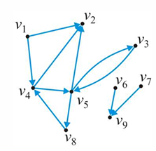
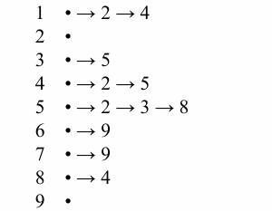
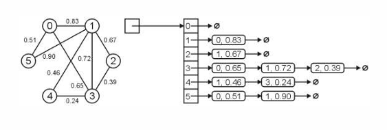

## 图的基本定义

图是一种用于存储**邻接关系（Adjacency）** 的抽象数据类型 (ADT)，由顶点和边组成：
- 顶点集合 $V=\{v_{1},v_{2},...,v_{n}\}$ 
- 连接顶点的边集合 $E$ 

图又被分为无向图和有向图；

### 度（Degree）

一个顶点的度为**与该顶点相邻的顶点数量（区分有向和无向）** 。
### 无向图（Undirected）

无向图的边为无序对 $\{v_{i},v_{j}\}$，表示 $v_{i}$ 与 $v_{j}$ 互为邻接。
需要注意：无向图的边**不包括自反**，即 $\{v_{1},v_{1}\}$ 不是边。

通过排列组合可以知道：无向图的最大边数为：
$$\|E\|\le\binom{\|V\|}{2}=\frac{\|V\|(\|V\|-1)}{2}=O(\|V\|^{2})$$
#### 无向图的度

就是和其邻接的顶点数，

#### 路径（Path）

路径是具有方向的。
通常定义为，顶点的有序序列 $(v_{0},v_{1},v_{2},...,v_{k})$，其中每对相邻顶点 $\{v_{j-1},v_{j}\}$ 都是图中的边。
方向体现为这是一条“**从** $v_{0}$ **到** $v_{k}$ 的路径”。

如果路径经过的点各不相同（不重复），那么就是一条**简单路径（Simple Path）**；
如果简单路径的起点和终点相同，那么就是一个**简单环（Simple Cycle）**；
但是这些定义可能在不同材料中有不同定义方式。

#### 连通性（Connectedness）

如果两点间存在路径，则称这两点是连通的；
如果图中任意两点间都存在路径，则该图是连通图（Connected Graph）。

### 特殊类型的图结构（基于路径而来）

1. 加权图 (Weighted Graphs)：
- 每条边关联一个权重（如距离、成本等）
- 路径长度是路径上所有边的权重之和
- **最短路径问题**：寻找两点间权重和最小的路径

2. 树：
- 连通且任意两点间有且仅有一条路径的图 
- 树是无环的（Acyclic）
- 边数 $\|E\|=\|V\|-1$ 
- 增加一条边或者删除一条边都会导致图不连通，也就不是树了
- 可以选定一个顶点为根，递归定义邻居为子节点来形成有根树

3. 森林（Forests）
- 无环图就是森林，可以是多棵树；
- $\|E\|<\|V\|$ ，树的数量为 $\|V\|-\|E\|$ ；

### 有向图（Directed Graph）

有向图的边是有方向的有序对 $(v_{j},v_{k})$，表示从 $v_{j}$ 到 $v_{k}$ 。
最大边数：$$|E|\le|V|(\|V\|-1)=O(\|V\|^{2})$$
是无向图的两倍，两点之间可以来去两条。

#### 有向图的度

因为具有方向，所以分为：
- **出度 (Out-degree)**：从该顶点出发的边数 （指向别人）；
- **入度 (In-degree)**：指向该顶点的边数 ，（被指向）；

#### 源与汇 (Sources and Sinks)

- 源 (Source)：入度为 0 的顶点 。
- 汇 (Sink)：出度为 0 的顶点 。
可以用水源和汇流处来理解。

#### 连通性

当 $v_j$ 指向 $v_k$ ， $v_j,v_k$ 才是连通的（注意方向）

有向图分为：
- **强连通 (Strongly connected)**：任意两点间都存在有向路径 。
- **弱连通 (Weakly connected)**：忽略方向后，任意两点间存在路径 。

#### **有向无环图 (DAG)**：

无环的有向图，常用于表示偏序关系、编译器解析树、类继承依赖等 。

以上内容均在离散数学中有更加详细的证明和解释，故不赘述。

## 图的表示和实现

表示邻接关系有三种方法：
- 二元关系列表 (Binary-relation list)
- 邻接矩阵 (Adjacency Matrix)
- 邻接表 (Adjacency List)

关于邻接关系的具体实现我们主要来看后两种：临界矩阵和邻接表。
### 二元关系列表 (Binary-relation list)

这是效率最低的一种存储方式，主要想法是存储图的全部边。
需要 $\Theta(|E|)$ 的内存空间，判断邻接需要 $O(|E|)$ 的时间，找到他的全部邻居需要 $\Theta(|E|)$ 的时间。

### 邻接矩阵 (Adjacency Matrix)

邻接矩阵存储需要消耗相比于上面更多的空间 $\Theta(\|V\|^{2})$ ，但是可以获得更快的速度；
判断邻接只需要 $O(1)$ 的时间，查找所有邻居需要 $\Theta(\|V\|)$ 。

具体想法是：使用一个 $N\times N$ 的矩阵（N是顶点数）来存储两点是否邻接（0或1），如果有权重则为对应边的权重。
对于*无向图*来说，邻接矩阵**一定是对称的**（$a_{ij}=a_{ji}$），但是*有向图*则不一定。

#### 邻接矩阵的二维数组表示

邻接矩阵可以用一个二维数组表示，但是 `C++` 中并没有给出其表示，因此我们需要自己构建一个二维数组。

假设需要构建一个 $16\times 16$ 的矩阵，那么可以将其分解为16个 含有16个元素的数组。

含16个元素的数组 arr：`double* arr[16];` 

`arr` 的数据类型是 `double *` ，也就是一个双精度浮点数类型的指针（用于存储数组第一个元素的地址）；所以我们还需要还需要存储16个指向 `double *` 这个**指针的指针**。即：

```c++
double** matrix;
matrix = new double* [16];
```

**注意：** 在初始化二维数组时，必须要先给出第二个值，也就是列。因为这样编译器才知道每个数组要先分配多少空间。至于多少个数组就是后面的事。

如果现在需要找到 `matrix[3][4]` ：`matrix` 指向首个数组指针，3为索引为3数组的指针，4为第四个数组指针的索引为5元素。


但通常我们采用的不是这种静态申请的方式，而是动态管理内存。因此 `new` 完后需要 `delete` 两类指针：
- 上图右边含有16个元素的这个数组的*数组指针*；
- 左边16个指向*数值指针的指针*；

#### 一些默认值的设定

对于表示权重的邻接矩阵，两个没有连通的顶点更加直观的默认表示是将 `matrix[i][j]` 设置为 $\infty$ ，表示断开的两个点距离为 $\infty$ 。

```c++
for (int i = 0; i < N; ++i) { // 初始化
    for (int j = 0; j < N; ++j) {
        matrix[i][j] = INF;
    }
    matrix[i][i] = 0; // 每个顶点和自己的距离都是0，无边
}
```

而对于非权重邻接矩阵，就可以使用布尔值来表示。

```c++
for (int i = 0; i < N; ++i) { // 初始化
    for (int j = 0; j < N; ++j) {
        matrix[i][j] = false;
    }
    matrix[i][i] = true;
}
```

这里设置了 `matrix[i][i] = true` ，意思是顶点自己和自己始终是连通的，但是**并不和自己邻接（有没有边）**。

### 邻接链表 (Adjacency List)

邻接链表存储是三个方式中**最高效的**。
通过类似于链表的方式来存储每个顶点的邻居。（见下图）

  

对于邻接表：
- 存储需要 $\Theta(\|V\|+\|E\|)$ 的空间；
- 判断一个顶点的邻居需要 $O(\frac{\|E\|}{\|V\|})$ 的时间；
- 找到一个节点的全部邻居需要 $\Theta(\frac{\|E\|}{\|V\|})$ 的时间；

$\Theta(\frac{\|E\|}{\|V\|})$ 指的是平均每一个顶点后，用于表示其邻居的链表长度。

在上面[邻接矩阵](#邻接矩阵的二维数组表示)的实现中，其实能发现使用矩阵来存储邻接关系是很浪费空间的，大约只有5%的位置是被非默认值（非0、$\infty$）占据。所以我们说这个矩阵是很稀疏的（Sparse）。

邻接表则是一种更加高效的实现方式。

一种设计数据类型的方法是：
```c++
class SingleNode {
private:
    int adjacent_vertex;
    double edge_weight;
    SingleNode* next_node;
public:
    SingleNode(int, double, SingleNode* = 0);
    double weight() const;
    int vertex() const;
    SingleNode* next() const;
};
```

存储了该顶点邻居的标识符（顶点编号），边的权重和指向下个顶点的指针；
但是更好的实现方法是将边和邻居的编号成对（边-点）存储：
```c++
class Pair {
private:
    double edge_weight;
    int adjacent_vertex;
public:
    Pair(int, double);
    double weight() const;
    int vertex() const;
};
```

然后再创建一个**链表数组**来存储对应顶点信息。
```cpp
SingleList<Pair>* array; 
array = new SingleList<Pair> [16]; 
```

需要注意，在无向图中，为了减少冗余（同一条边被两个顶点储存），需要设计为只存储在索引较大的顶点的链表（或者更小的）。
```cpp
void insert( int i, int j, double w ) {
    if ( i < j ) {
        array[j].push_front( Pair(i, w) );
    } else {
        array[i].push_front( Pair(j, w) );
    }
}
```

如图是一个无向有权重图的邻接链表：




在图的表示和实现中，很多情况都不同。这取决于图的属性：
- 有向？无向？
- 有无权重？
- 稀疏还是稠密？

## 图的搜索遍历

### 广度优先遍历（Breadth First Traversal）

图的广度优先遍历也可以通过队列的方式实现：
```c++
void Graph::breadth_first_traversal(Vertex *first) const {
    // 使用哈希表来记录已访问的顶点，防止重复访问和死循环
    // 这里的 hash 充当 visited 数组的功能
    unordered_map<Vertex *, int> hash;
    hash.insert(first); // 标记起始顶点为已访问

    std::queue<Vertex *> queue;
    queue.push(first); // 将起始顶点入队,起始顶点可以随机选取

    while (!queue.empty()) {
        Vertex *v = queue.front();
        queue.pop();
        // Perform an operation on v

        // 遍历 v 的所有邻接顶点
        for (Vertex *w : v->adjacent_vertices()) {
            // 如果邻接顶点 w 未被访问过
            if (!hash.member(w)) {
                hash.insert(w); // 标记 w 为已访问
                queue.push(w);  // 将 w 入队，等待后续访问
            }
        }
    }
}
```

具体流程：（和在树中的实现极为相像，只是现在只对未被访问节点的进行遍历）
如果队列非空，
- 选择一个节点作为初始节点并push进队列；
- 对于当前节点的邻居，如果未被访问过，标记为已访问并push进队列；

### 深度优先搜索（Depth First Traversal）

深度优先搜索可以使用栈来实现：
递归实现：（这里使用的栈其实是系统递归时的**函数调用栈 Call Stack**）
```c++
// 主函数入口
void Graph::depth_first_traversal(Vertex *first) const {
    // 创建哈希表记录访问状态
    std::unordered_map<Vertex *, int> hash;
    hash.insert(first); // 标记起始点
    
    // 调用顶点自身的递归函数
    first->depth_first_traversal(hash);
}

// 顶点自身的递归函数
void Vertex::depth_first_traversal(unordered_map<Vertex *, int> &hash) const {
    // Perform an operation on this

    // 遍历当前顶点的所有邻接顶点
    for (Vertex *v : adjacent_vertices()) {
        // 如果邻接点 v 未被访问
        if (!hash.member(v)) {
            hash.insert(v); // 标记为已访问
            // 递归调用，深入下一层
            v->depth_first_traversal(hash);
        }
    }
}
```

使用**显式的栈**来实现：
```c++
void Graph::depth_first_traversal(Vertex *first) const {
    // 记录已访问顶点的哈希表
    unordered_map<Vertex *, int> hash;
    hash.insert(first);

    // 使用标准库栈 (stack) 
    std::stack<Vertex *> stack;
    stack.push(first); // 压入起始顶点

    while (!stack.empty()) {
        // 获取并弹出栈顶元素
        Vertex *v = stack.top();
        stack.pop();
        // Perform an operation on v (print)

        // 遍历 v 的所有邻接顶点
        for (Vertex *w : v->adjacent_vertices()) {
            // 如果邻接点 w 未被访问
            if (!hash.member(w)) {
                hash.insert(w); // 标记为已访问
                stack.push(w);  // 将 w 压入栈中，下次循环将优先访问它（后进先出）
            }
        }
    }
}
```

具体流程在 *P83-108* 

通过广度、深度优先遍历可以检查一个图中的顶点是否连通？（遍历完后还有没有未被访问的节点）