# 图的基本定义

图是一种用于存储**邻接关系（Adjacency）** 的抽象数据类型 (ADT)，由顶点和边组成：
- 顶点集合 $V=\{v_{1},v_{2},...,v_{n}\}$ 
- 连接顶点的边集合 $E$ 

图又被分为无向图和有向图；

## 度（Degree）

一个顶点的度为**与该顶点相邻的顶点数量（区分有向和无向）** 。
## 无向图（Undirected）

无向图的边为无序对 $\{v_{i},v_{j}\}$，表示 $v_{i}$ 与 $v_{j}$ 互为邻接。
需要注意：无向图的边**不包括自反**，即 $\{v_{1},v_{1}\}$ 不是边。

通过排列组合可以知道：无向图的最大边数为：
$$\|E\|\le\binom{\|V\|}{2}=\frac{\|V\|(\|V\|-1)}{2}=O(\|V\|^{2})$$
### 无向图的度

就是和其邻接的顶点数，

### 路径（Path）

路径是具有方向的。
通常定义为，顶点的有序序列 $(v_{0},v_{1},v_{2},...,v_{k})$，其中每对相邻顶点 $\{v_{j-1},v_{j}\}$ 都是图中的边。
方向体现为这是一条“**从** $v_{0}$ **到** $v_{k}$ 的路径”。

如果路径经过的点各不相同（不重复），那么就是一条**简单路径（Simple Path）**；
如果简单路径的起点和终点相同，那么就是一个**简单环（Simple Cycle）**；
但是这些定义可能在不同材料中有不同定义方式。

### 连通性（Connectedness）

如果两点间存在路径，则称这两点是连通的；
如果图中任意两点间都存在路径，则该图是连通图（Connected Graph）。

## 特殊类型的图结构（基于路径而来）

1. 加权图 (Weighted Graphs)：
- 每条边关联一个权重（如距离、成本等）
- 路径长度是路径上所有边的权重之和
- **最短路径问题**：寻找两点间权重和最小的路径

2. 树：
- 连通且任意两点间有且仅有一条路径的图 
- 树是无环的（Acyclic）
- 边数 $\|E\|=\|V\|-1$ 
- 增加一条边或者删除一条边都会导致图不连通，也就不是树了
- 可以选定一个顶点为根，递归定义邻居为子节点来形成有根树

3. 森林（Forests）
- 无环图就是森林，可以是多棵树；
- $\|E\|<\|V\|$ ，树的数量为 $\|V\|-\|E\|$ ；

## 有向图（Directed Graph）

有向图的边是有方向的有序对 $(v_{j},v_{k})$，表示从 $v_{j}$ 到 $v_{k}$ 。
最大边数：$$|E|\le|V|(\|V\|-1)=O(\|V\|^{2})$$
是无向图的两倍，两点之间可以来去两条。

### 有向图的度

因为具有方向，所以分为：
- **出度 (Out-degree)**：从该顶点出发的边数 （指向别人）；
- **入度 (In-degree)**：指向该顶点的边数 ，（被指向）；

### 源与汇 (Sources and Sinks)

- 源 (Source)：入度为 0 的顶点 。
- 汇 (Sink)：出度为 0 的顶点 。
可以用水源和汇流处来理解。

### 连通性

当 $v_j$ 指向 $v_k$ ， $v_j,v_k$ 才是连通的（注意方向）

有向图分为：
- **强连通 (Strongly connected)**：任意两点间都存在有向路径 。
- **弱连通 (Weakly connected)**：忽略方向后，任意两点间存在路径 。

### **有向无环图 (DAG)**：

无环的有向图，常用于表示偏序关系、编译器解析树、类继承依赖等 。

以上内容均在离散数学中有更加详细的证明和解释，故不赘述而是进行了总结。

# 图的表示和实现

表示邻接关系有三种方法：
- 二元关系列表 (Binary-relation list)
- 邻接矩阵 (Adjacency Matrix)
- 邻接表 (Adjacency List)

关于邻接关系的具体实现我们主要来看后两种：临界矩阵和邻接表。
### 二元关系列表 (Binary-relation list)

这是效率最低的一种存储方式，主要想法是存储图的全部边。
需要 $\Theta(|E|)$ 的内存空间，判断邻接需要 $O(|E|)$ 的时间，找到他的全部邻居需要 $\Theta(|E|)$ 的时间。

### 邻接矩阵 (Adjacency Matrix)

邻接矩阵存储需要消耗相比于上面更多的空间 $\Theta(\|V\|^{2})$ ，但是可以获得更快的速度；
判断邻接只需要 $O(1)$ 的时间，查找所有邻居需要 $\Theta(\|V\|)$ 。

具体想法是：使用一个 $N\times N$ 的矩阵（N是顶点数）来存储两点是否邻接（0或1），如果有权重则为对应边的权重。
对于*无向图*来说，邻接矩阵**一定是对称的**（$a_{ij}=a_{ji}$），但是*有向图*则不一定。

#### 邻接矩阵的二位数组表示

邻接矩阵可以用一个二维数组表示，但是 `C++` 中并没有给出其表示，因此我们需要自己构建一个二位数组。

假设需要构建一个 $16\times 16$ 的矩阵，那么可以将其分解为16个 含有16个元素的数组。
`double arr[16];` 
`arr` 的数据类型是 `double *` ，也就是一个双精度浮点数类型的指针（用于存储数组第一个元素的地址）；所以我们还需要还需要存储16个指向 `double *` 这个**指针的指针**。即：

```cpp
double** matrix;
matrix = new double* [16];
```

**注意：** 在初始化二维数组时，必须要先给出第二个值，也就是列。因为这样编译器才知道每个数组要先分配多少空间。至于多少个数组就是后面的事。

如果现在需要找到 `matrix[3][4]` ：`matrix` 指向首个数组指针，3为索引为3数组的指针，4为第四个数组指针的索引为5元素。


但通常我们采用的不是这种静态申请的方式，而是动态管理内存。因此 `new` 完后需要 `delete` 两类指针：
- 上图右边含有16个元素的这个数组的*数组指针*；
- 左边16个指向*数值指针的指针*；

#### 一些默认值的设定

对于表示权重的邻接矩阵，两个没有连通的顶点更加直观的默认表示是将 `matrix[i][j]` 设置为 $\infty$ ，表示断开的两个点距离为 $\infty$ 。

```cpp
for (int i = 0; i < N; ++i) { // 初始化
    for (int j = 0; j < N; ++j) {
        matrix[i][j] = INF;
    }
    matrix[i][i] = 0; // 每个顶点和自己的距离都是0，无边
}
```

而对于非权重邻接矩阵，就可以使用布尔值来表示。

```cpp
for (int i = 0; i < N; ++i) { // 初始化
    for (int j = 0; j < N; ++j) {
        matrix[i][j] = false;
    }
    matrix[i][i] = true;
}
```

这里设置了 `matrix[i][i] = true` ，意思是顶点自己和自己始终是连通的，但是**并不和自己邻接（有没有边）**。

### 邻接链表 (Adjacency List)

邻接链表存储是三个方式中**最高效的**。
通过类似于链表的方式来存储每个顶点的邻居。（见下图）

  

对于邻接表：
- 存储需要 $\Theta(\|V\|+\|E\|)$ 的空间；
- 判断一个顶点的邻居需要 $O(\frac{\|E\|}{\|V\|})$ 的时间；
- 找到一个节点的全部邻居需要 $\Theta(\frac{\|E\|}{\|V\|})$ 的时间；

$\Theta(\frac{\|E\|}{\|V\|})$ 指的是平均每一个顶点后，用于表示其邻居的链表长度。

在上面[邻接矩阵](#邻接矩阵的二位数组表示)的实现中，其实能发现使用矩阵来存储邻接关系是很浪费空间的，大约只有5%的位置是被非默认值（非0、$\infty$）占据。所以我们说这个矩阵是很稀疏的（Sparse）。

邻接表则是一种更加高效的实现方式。

一种设计数据类型的方法是：
```cpp
class SingleNode {
private:
    int adjacent_vertex;
    double edge_weight;
    SingleNode* next_node;
public:
    SingleNode(int, double, SingleNode* = 0);
    double weight() const;
    int vertex() const;
    SingleNode* next() const;
};
```

存储了该顶点邻居的标识符（顶点编号），边的权重和指向下个顶点的指针；
但是更好的实现方法是将边和邻居的编号成对（边-点）存储：
```cpp
class Pair {
private:
    double edge_weight;
    int adjacent_vertex;
public:
    Pair(int, double);
    double weight() const;
    int vertex() const;
};
```

然后再创建一个**链表数组**来存储对应顶点信息。
```cpp
SingleList<Pair>* array; 
array = new SingleList<Pair> [16]; 
```

需要注意，在无向图中，为了减少冗余（同一条边被两个顶点储存），需要设计为只存储在索引较大的顶点的链表（或者更小的）。
```cpp
void insert( int i, int j, double w ) {
    if ( i < j ) {
        array[j].push_front( Pair(i, w) );
    } else {
        array[i].push_front( Pair(j, w) );
    }
}
```

如图是一个无向有权重图的邻接链表：


在图的表示和实现中，很多情况都不同。这取决于图的属性：
- 有向？无向？
- 有无权重？
- 稀疏还是稠密？

# 图的搜索遍历

## 广度优先遍历

图的广度优先遍历也可以通过队列的方式实现：
```c++
void Graph::breadth_first_traversal(Vertex *first) const {
    // 使用哈希表来记录已访问的顶点，防止重复访问和死循环
    // 这里的 hash 充当 visited 数组的功能
    unordered_map<Vertex *, int> hash;
    hash.insert(first); // 标记起始顶点为已访问

    std::queue<Vertex *> queue;
    queue.push(first); // 将起始顶点入队,起始顶点可以随机选取

    while (!queue.empty()) {
        Vertex *v = queue.front();
        queue.pop();
        // Perform an operation on v

        // 遍历 v 的所有邻接顶点
        for (Vertex *w : v->adjacent_vertices()) {
            // 如果邻接顶点 w 未被访问过
            if (!hash.member(w)) {
                hash.insert(w); // 标记 w 为已访问
                queue.push(w);  // 将 w 入队，等待后续访问
            }
        }
    }
}
```

具体流程：（和在树中的实现极为相像，只是现在只对未被访问节点的进行遍历）
如果队列非空，
- 选择一个节点作为初始节点并push进队列；
- 对于当前节点的邻居，如果未被访问过，标记为已访问并push进队列；

## 深度优先搜索

深度优先搜索可以使用栈来实现：
递归实现：（这里使用的栈其实是系统递归时的**函数调用栈 Call Stack**）
```c++
// 主函数入口
void Graph::depth_first_traversal(Vertex *first) const {
    // 创建哈希表记录访问状态
    std::unordered_map<Vertex *, int> hash;
    hash.insert(first); // 标记起始点
    
    // 调用顶点自身的递归函数
    first->depth_first_traversal(hash);
}

// 顶点自身的递归函数
void Vertex::depth_first_traversal(unordered_map<Vertex *, int> &hash) const {
    // Perform an operation on this

    // 遍历当前顶点的所有邻接顶点
    for (Vertex *v : adjacent_vertices()) {
        // 如果邻接点 v 未被访问
        if (!hash.member(v)) {
            hash.insert(v); // 标记为已访问
            // 递归调用，深入下一层
            v->depth_first_traversal(hash);
        }
    }
}
```

使用**显式的栈**来实现：
```c++
void Graph::depth_first_traversal(Vertex *first) const {
    // 记录已访问顶点的哈希表
    unordered_map<Vertex *, int> hash;
    hash.insert(first);

    // 使用标准库栈 (stack) 
    std::stack<Vertex *> stack;
    stack.push(first); // 压入起始顶点

    while (!stack.empty()) {
        // 获取并弹出栈顶元素
        Vertex *v = stack.top();
        stack.pop();
        // Perform an operation on v (print)

        // 遍历 v 的所有邻接顶点
        for (Vertex *w : v->adjacent_vertices()) {
            // 如果邻接点 w 未被访问
            if (!hash.member(w)) {
                hash.insert(w); // 标记为已访问
                stack.push(w);  // 将 w 压入栈中，下次循环将优先访问它（后进先出）
            }
        }
    }
}
```

具体流程在 *P83-108* 

通过广度、深度优先遍历可以检查一个图中的顶点是否连通？（遍历完后还有没有未被访问的节点）

# 生成树 Spanning Tree

给定连通图中的 $\|V\|=n$ 个节点，使用 n-1 条边将这些点连接起来。在这些点中选取一个根节点，即成为一颗生成树。生成树不是唯一的，可以选取不同的顶点作为根节点。

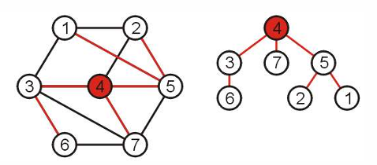

生成树可以很奇特：

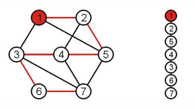

## 最小生成树 Minimal Spanning Tree

如果我们将这个图的边添加权重，那么所包含的边权重最小的生成树就是**最小生成树**。对于没有显式给出权重的图，我们可以认为连通的边权重为1，未连通的边权重为0。

多个最小生成树组成的集合就是一个最小生成森林。

根据最小生成树的定义，假设当前随机给出一个顶点。要想实现最小生成树，需要考虑它的全部邻居，并且找到一个节点，它和当前节点连通的边的权重是所有邻居当中最小的（距离最近的），连到当前节点。

假如此时已经有一个部分构建好的最小生成树，把它看成一个超级顶点，那么需要考虑的就是这个超级顶点的全部邻居连通的边，找到最小的那个。如图中的边 $e_k$ 和顶点 $v_{k+1}$ 。

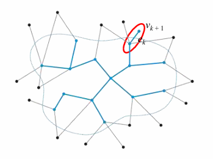

关于为什么始终要连接权重最小的这个边，可以使用反证法去验证（在直觉上这可能是成立的），在此不赘述。 *P136* 

### Prim 算法构建最小生成树

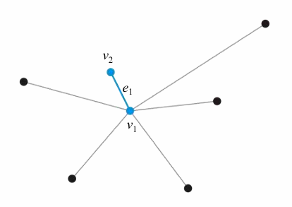 

关于最小生成树的构建，**Prim 算法**给出了相似的步骤：
- 随机选取一个顶点作为MST构建的开始节点 （$v_1$）；
- 选择一个和当前MST距离最近（$e_1$）的一个邻居顶点（$v_2$）进行连接；
- 如果仍有未被访问的顶点，继续迭代：
	- 选择和当前**MST距离最近且未被访问**的邻居；
	- 将**这个邻居（$V_i$）** 标记为已被访问（连入当前MST）；
	- 检查 $V_i$ 的未被访问的邻居，**如果现在连通边的距离是更小的**，那么
		- 将未被访问的邻居顶点到 $V_i$ 的距离（也就是到MST的距离）更新为现在更近的这个距离；
		- 将 $V_i$ 设为其邻居的parent；

**在这个过程中需要始终注意的是**：
当我们选择了距离当前MST最近的邻居顶点（$V_i$）后，需要更新的是 $V_i$ 的邻居顶点的distance和parent状态。

选择最近的顶点是对于MST（整个表）来说的，可能需要更新的邻居顶点是对于新加入的这个顶点（$V_i$）来说的。

使用 Prim 算法构建MST时，需要先构造3个数据：
- 一个布尔值，用于标记某个顶点是否连接到了当前的MST；
- 当前MST（超级顶点）和某个邻居连接的边的权重（看作距离distance）；
- 某个邻居和当前MST中的哪个顶点相连（像一个指针，指向parent）；

这三个数据都可以通过array/vector来存储，初始化需要 $\Theta(\|V\|)$ 的时间和空间复杂度。

然后将数据初始化：（见下图）
- 随机选择一个根节点并将其distance设为0，其余全部节点的distance设为 $\infty$ ；
- 全部节点都设置为未被访问（未连接到MST）；
- 顶点和MST中相连的顶点（parent）编号为0（没有和MST中的顶点连接）；

首先选取顶点1作为根节点：（*P150-167*）
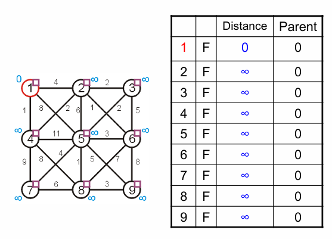
将顶点1加入MST，更新1的状态和1邻居的状态：

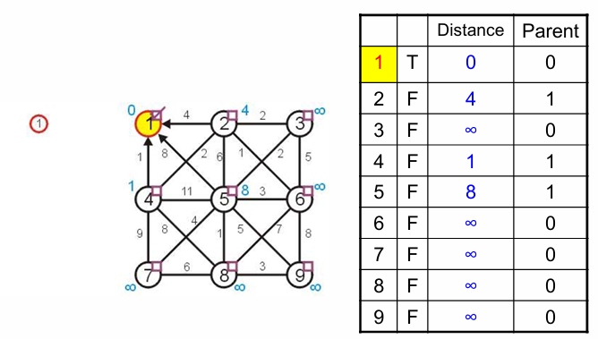

在1邻居中挑选**未被访问且distance最小**的邻居连接，即4，并更新4及其邻居的信息；

注意这里不能更新5的distance，5和当前MST连接的顶点是1，distance=8，小于和4相连的distance=11，因此parent仍指向1；

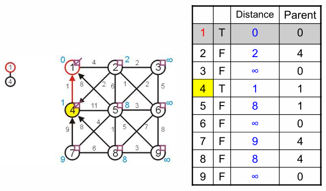

在4的邻居中挑选未被访问且distance最小的邻居连接，即2，更新2及其邻居信息；

此时需要更新5的distance，因为5连接到当前MST的顶点（2号）距离最近，小于连接到1、2、4的distance。

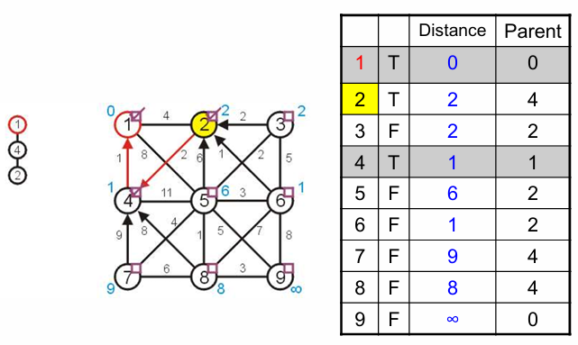

在12的邻居中挑选未被访问且distance最小的邻居连接，即6，更新6及其邻居信息；

此时5的信息又被更新了，连接到当前MST顶点（6号）的distance更小，小于之前的6号distance=6。并且8号的信息也被更新，比之前和4号相连的要小。


不断进行下去，直到没有未被访问的顶点，构建完成最小生成树。可能会有顶点无法连接上，那就说明该MST是当前图$G$的一个连通子图$G_{sub}$，但这个图$G$不是一个连通图。

在上面的这个过程中，我们需要不断地遍历这个列表来不断更新当前MST的全部邻居并找到距离最近的那个顶点然后连接。但是我们每一次的访问总会减少一个未被访问的顶点，所以Prim算法尽可能地将需要访问的顶点数降到了最低。

### Prim 时间复杂度分析：

1、首个顶点是随机选取的，需要再遍历 $\|V\|-1$ 个顶点才能构建，那么就需要 $\Theta(V)$ 的时间；

2、在上面遍历每个顶点的过程中，
- 为了找到距离最小的未被访问的邻居，还需要遍历整个表，花费 $\Theta(V)$ 的时间；
- 每当我们遍历完整个表，找到一个符合要求的邻居顶点，将其连入后还需要考虑他的全部邻居，因为我们还要判断他的全部邻居顶点有没有被访问过？如果没有，需不需要更新更短的距离？

但是现在，回顾一下前面提到的邻接矩阵和邻接表，我们发现这两种不同的表示形式会对这一步花费的时间产生不同的影响。
- 对于邻接矩阵，给定一个节点，找它的邻居节点并判断要不要更新需要 $\Theta(\|V\|)$ 的时间；这样，总的时间复杂度就是 $\Theta(\|V\|(\|V\|+\|V\|))=\Theta(\|V\|^2)$ 
- 对于邻接表，每一个节点的后面跟着的邻居节点链表长度平均为 $\frac{\|E\|}{\|V\|}$ ，给定节点的邻居节点查找并判断是否要更新需要 $\Theta(\frac{\|E\|}{\|V\|})$ 的时间 ；这样，总的时间复杂度就是 $\Theta(\|V\|(\|V\|+\frac{\|E\|}{\|V\|}))=\Theta(\|V\|^2+\|E\|)$ ，而 $\|E\|=O(\|V\|^2)$ （在前面无向图的部分有提到），因此最终还是为 $\Theta(\|V\|^2)$ 。

到这里，我们总是会继续发问，还能更快吗？

来一步步看看哪里还有改进的空间。

主循环需要遍历完 $\|V\|-1$ 个节点，这里我们没法再压榨出时间了；

每个循环中，我们需要找到距离最近的那个邻居节点，这其实很像一个排序问题，需要找到那个最小的元素。但我们学习过的排序算法最快也是 $O(n)$ 的时间，而且稳定的都是 $O(log(n))$ 的，好像让Prim变得更糟了。

再仔细想一下，这其实也可以看成是一种**优先队列**，毕竟我们一直要的只是距离最小的那个，并不对后面元素的顺序做出多么苛刻的要求。那么用堆（Min-Heap）来实现不失为一个很好的选择，这里需要用到的堆的操作（`push`，`insert`，上下滤）都是和堆高有关，也就是 $O(log(n))$ ，在这里我们找到了继续压榨时间的可能。

然后再看，当我们添加了一个距离最近的邻居节点后，还需要遍历他的邻居节点并判断是否需要更新distance和parent。这里我们仍旧没有办法压榨时间。

所以我们在这里就需要考虑如何使用堆来加速距离最近的节点的查找。
- 使用邻接矩阵，遍历新加入的最近的邻居节点还是需要 $\Theta(\|V\|)$ ，由上面的式子可得，最终的时间复杂度还是 $\Theta(\|V\|^2)$ 。
- 使用**邻接表**，先直接给出结论：$O(\|V\|ln(\|V\|) + \|E\|ln(\|V\|))=O(\|E\|ln(\|V\|))$ 。

如果我们使用邻接表并且搭配优先队列（堆），来使用，那就有可能做到更快。上面的结论可以先记住，需要搭配后面代码来理解。

```c++
#include <iostream>
#include <vector>
#include <queue>
#include <climits> // 用于 INT_MAX

using namespace std;

const int INF = INT_MAX;

// 定义一个别名，pair<int, int> 用于存储 {权重, 顶点}
typedef pair<int, int> iPair;

// 图的类定义
class Graph {
    int V; // 顶点数量
    // 邻接表实现：adj[u] 包含多个 pair {v, weight}，表示 u -> v 权重为 weight
    vector<vector<pair<int, int>>> adj;
public:
    Graph(int V) { // 构造函数
        this->V = V;
        adj.resize(V);
    }
    
    // 添加无向边
    void addEdge(int u, int v, int weight) {
        adj[u].push_back({v, weight});
        adj[v].push_back({u, weight}); // 无向图需双向添加
    }
    
    // Prim算法核心实现
    void primMST() {
        // 1. 优先队列（最小堆）：存储 {当前最小权重, 目标顶点}
        // greater<PII> 确保队首是权重最小的元素，这和 C++STL 中 priority_queue 的实现有关
        // priority_queue<Type, Container, Functional>，Functional 即排序方式
        priority_queue<iPair, vector<iPair>, greater<iPair>> pq;

        // 2. 距离数组 (key/distance)：存储从 MST 到该顶点的最小边权
        // 初始化为无穷大
        vector<int> key(V, INF);

        // 3. 父节点数组 (parent)：用于记录 MST 的结构（边的来源）
        vector<int> parent(V, -1);

        // 4. 访问标记数组 (visited)：记录顶点是否已加入 MST
        vector<bool> inMST(V, false);

        // --- 初始化起始点 ---（虚拟节点？那下一个怎么办，这个虚拟节点的邻居是谁？堆里面现在有谁，存疑）
        int src = 1; // 从顶点 1 开始（可以任意选择）
        pq.push({0, src}); // 将起点入队，权重设为 0
        key[src] = 0;      // 起点到 MST 的距离为 0

        int totalWeight = 0; // 记录 MST 总权重
        int edgeCount = -1; // 记录加入的边的数量

        // --- 主循环 ---
        while (!pq.empty() && edgeCount < V - 1) {
            // 取出当前距离 MST 最近的顶点
            int u = pq.top().second;
            pq.pop();

            // 如果 u 已经在 MST 中，说明堆中这个元素已被访问，直接跳过
            // 需要注意，而由于STL中优先队列的限制，我们无法将旧的边权重更新或删除，
            // 采用的是只增不减的方法，所以可能会有多余的边堆积。
            // 但是我们设置了 while 的循环次数之后可以避免这个问题，另一个方法就是使用
            // 下面这行的方法来直接规避冗余边。
            // 其实可以不要这步，因为循环已经限制了次数，不会让同一节点的冗余边产生影响
            if (inMST[u]) continue;

            // 将 u 正式加入 MST
            inMST[u] = true;
            totalWeight += key[u]; // 累加权重 (对于起点是+0)
            edgeCount++;

            // --- 检查 u 的所有邻接点 v ---
            for (auto& edge : adj[u]) {
                int v = edge.first;
                int weight = edge.second;

                // 如果 v 还没在 MST 中，且通过 u 连接 v 的权重比 v 当前记录的权重更小
                if (!inMST[v] && weight < key[v]) {
                    // 更新 v 的最小权重
                    key[v] = weight;
                    // 记录 v 的父节点是 u
                    parent[v] = u;
                    // 将新的 {权重, 顶点} 入队
                    // 将权重放在前，因为 STL 优先队列默认第一个元素排序
                    pq.push({key[v], v});
                }
            }
        }
        
        // 5. 结果检查
        if (edgeCount < V - 1) {
            cout << "\n错误：图不连通！无法生成单一的最小生成树。" << endl;
        } else {
            cout << "\n最小生成树构建完成，总权重: " << totalWeight << endl;
        }
    }
};
```

`while` 到 `for` 循环之前：

```c++
while (!pq.empty() && edgeCount < V - 1) {
            // 取出当前距离 MST 最近的顶点
            int u = pq.top().second;
            pq.pop();
            
            inMST[u] = true;
            totalWeight += key[u];
            edgeCount++;
```

通过堆来寻找最小的边时，时间花费出现在 `pq.pop();` ，需要 $O(ln(\|E\|))$ 的时间。在最坏情况下，边的数量是 $\|E\|=O(\|V\|^2)$ ，那么就是 $O(ln(\|V\|))$ 的时间。在主循环中，总共遍历 $\|V\|-1$ 次，这一步花费 $O(\|V\|ln(\|V\|))$ 的时间。

`for` 循环中：

```c++
for (auto& edge : adj[u]) {
    int v = edge.first;
    int weight = edge.second;

    // 如果 v 还没在 MST 中，且通过 u 连接 v 的权重比 v 当前记录的权重更小
    if (!inMST[v] && weight < key[v]) {
        key[v] = weight;
        parent[v] = u;
        pq.push({key[v], v});
    }
}
```

检查新加入节点的邻居节点时，时间花费出现在 `if` 判断中 `pq.push({key[v], v});` 每一次 push 同样需要 $O(ln(\|V\|))$ 的时间。

在 `while` 主循环中，因为使用的是邻接链表，每次都要将新加入节点的所有邻接节点边 push 进去再进行判断和更新，也就是 $\|E\|$ ， 每一次 push 同样需要 $O(ln(\|V\|))$ 的时间。总共就是 $O(\|E\|ln(\|V\|))$ 。

 $\|E\|$ 最小也是  $\|V\|-1$ ，所以 $\|E\|$ 通常是更大的，
即最终：$O(\|V\|ln(\|V\|) + \|E\|ln(\|V\|))=O(\|E\|ln(\|V\|))$ 。

### Kruskal 算法构建最小生成树

最小生成树需要边的权重尽可能小，所以 Kruskal 算法给出了这样的实现：*P178* 
- 先将图中的所有边从小到大进行排序；
- 依次取出每个边，如果没有和当前构建的MST产生回路，那么就添加进MST；
- 直到最后走完所有的边就结束。

对于这个算法，
首先需要使用快排等排序算法将所有边根据权重进行排序，花费 $O(\|E\|ln(\|E\|))$ 的时间。

**从小到大**每次取出当前最短边（$O(\|E\|)$），还需要判断是否存在回路，即需要遍历全部点($O(\|V\|)$)，花费时间 $O(\|E\|\|V\|)$。（这里还有 $\|E\|=O(\|V\|^2)$？为什么只影响 $ln(\|E\|)$ ）

总时间为：$O(\|E\|ln(\|E\|))+O(\|E\|\|V\|)=O(\|E\|\|V\|)$。

我们发现，在判断回路这里花费了很多的时间，那么考虑一下有什么方法能加快？
- 不断向MST添加边这个行为和向一个集合中添加元素很像；
- 判断是否有回路和查找两个元素是否在一个集合中是一样的（`Find(a)==Find(b)`）；
- 添加的边将两个节点相连，和并查集中 `set_union` 很像；

因此我们可以使用并查集的方法来优化，模拟过程 *P205-217* 。

并查集优化后，需要添加 $\|E\|$ 条边；每添加一条边，就需要检查是否有回路并将边连通（在并查集中的实现为 $O(ln(\|V\|))$ ），这样时间复杂度就降低为 $O(\|E\|ln(\|V\|))$ 。

# 最短路径

在一个有权重的图中，还经常考虑这个图中两点间的最短的路径是什么样的？
## Dijkstra 最短路径算法

在最短路径的寻找中，我们需要关注的不再是当前状态下哪个邻接节点的边是最短的，我们需要考虑**从出发点一直到现在**时哪条路径是最短的。

假设边的权重都是正整数；

我们现在先从A出发，挑选最短的路径，到了B；

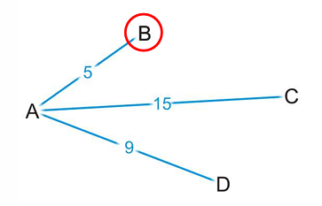

然后在从B往后走，此时如果到F，从A出发的路径长度为8，仍旧是目前最短的（小于AD=9）;

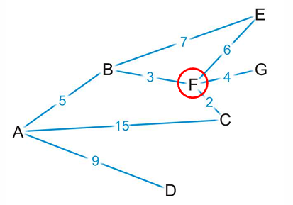

但是如果从F继续往后走，我们选择走到在邻接节点中更近的C，此时从A出发的路径长度就是10，大于从A直接到D的路径长度9。因此现在来说，从A到D应该是更短的一条路。

我们会发现，Dijkstra 算法和Prim算法的实现其实很像，

开始时都不知道除了起始点之外的边信息；
需要不断接入距离最近的边并更新邻接节点来确定下一步；

**不同的点在于**：

在检查邻接节点的距离时，最小生成树Prim算法只关注邻接节点中到新接入的这个节点最近（且未被访问过）的是谁？

而Dijkstra算法需要考虑从出发点一直到现在的路径长度，即接入哪个邻接节点可以使当前走过的全部路径最短？

具体模拟和Prim及其相像，*P251-284* 。

我们只需要修改Prim算法中的两处代码即可：

```c++
// Prim 算法判断邻接节点
for (auto& edge : adj[u]) {
    int v = edge.first;
    int weight = edge.second;

    // 这里只关注邻接节点的距离是否最小
    if (!inMST[v] && weight < key[v]) {
        // 更新 v 的最小权重
        key[v] = weight;
        parent[v] = u;
        pq.push({key[v], v});
    }
}

// Dijkstra 算法判断邻接节点
for (auto& edge : adj[u]) {
    int v = edge.first;
    int weight = edge.second;

    // 这里关注：到这个邻接节点的整条路径长度是否最小
    // Dijkstra 中的 key 是从出发点到 v 的路径长度旧记录
    if (!inMST[v] && key[u] + weight < key[v]) {
        // 更新到 v 的累加距离
        key[v] = key[u] + weight;
        previous[v] = u;
        pq.push({key[v], v});
    }
}
```

一旦我们找到了出发点（下图K）到每个节点的最短路径，只需要根据每个节点的 `prevoius` 回溯即可构建完整的最短路径。如果需要到特定节点，只需要判断找到节点停止即可。

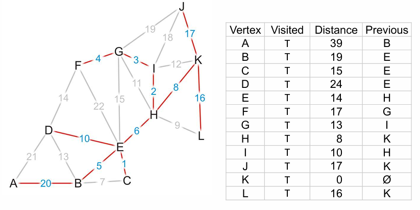

时间复杂度和Prim没有区别：$O(\|V\|ln(\|V\|) + \|E\|ln(\|V\|))=O(\|E\|ln(\|V\|))$。